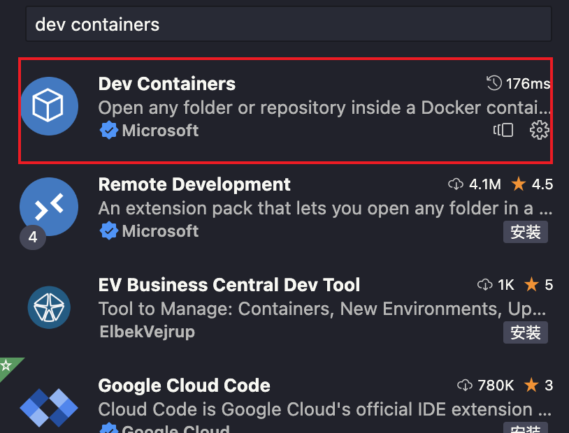
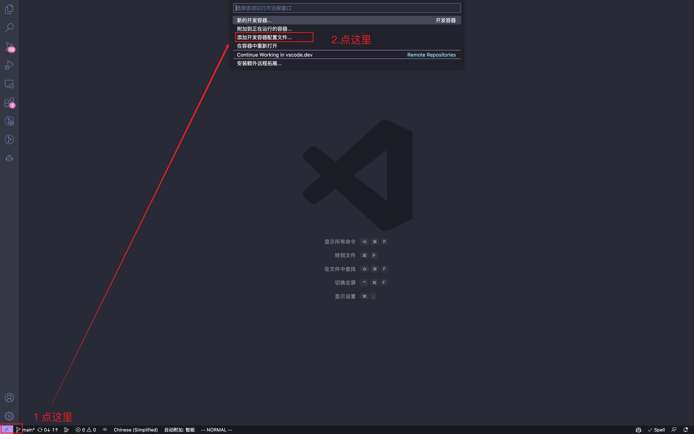
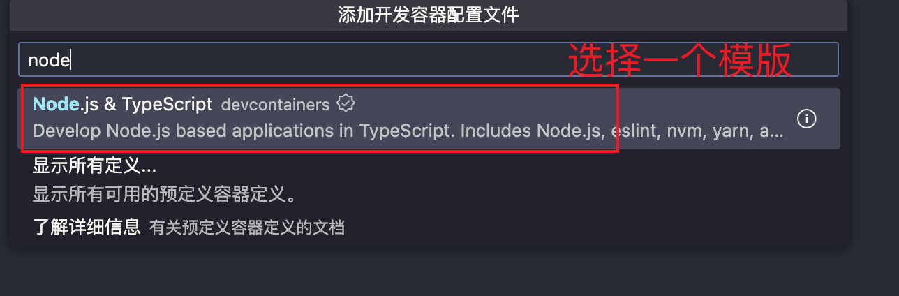
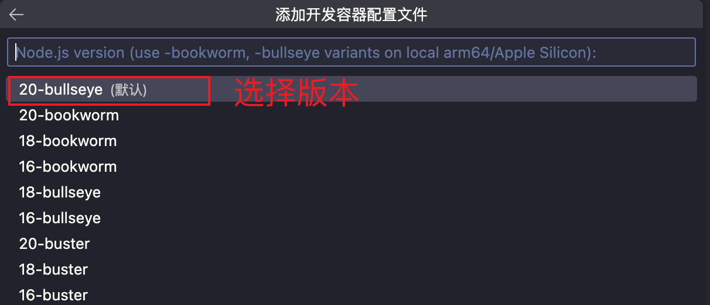
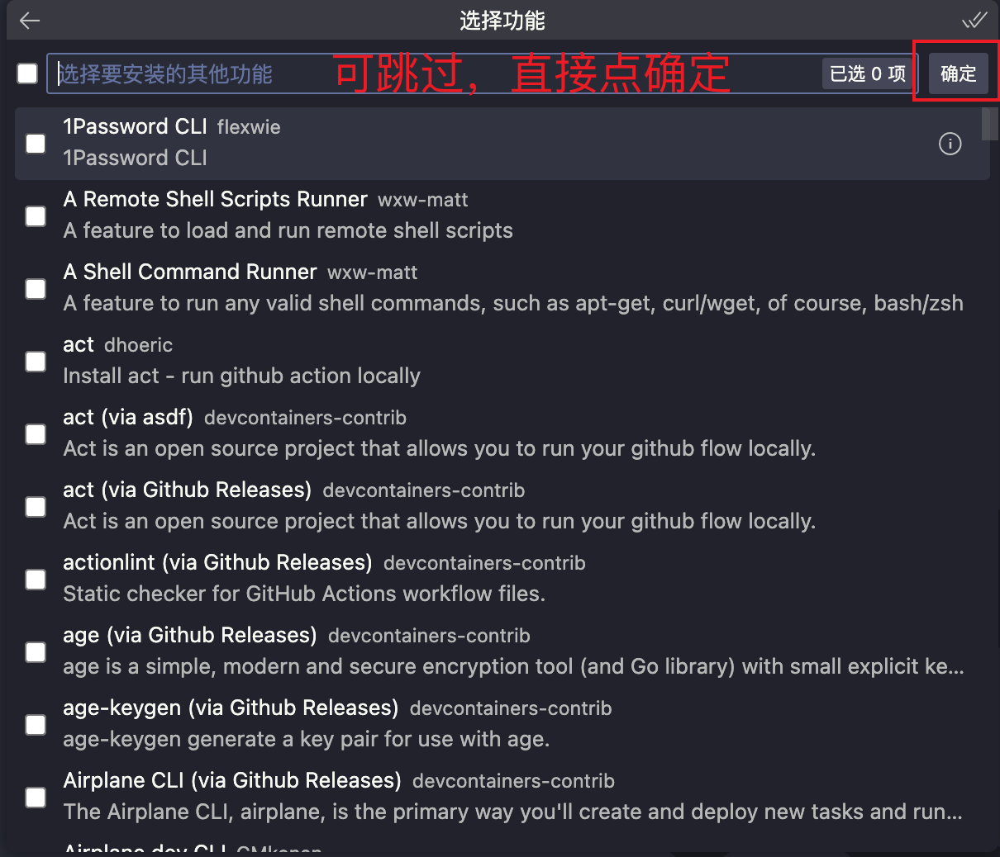
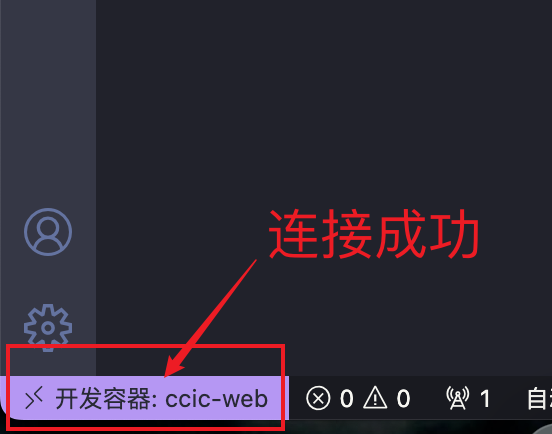

* `go` 镜像源码：[go-docker](https://github.com/astak16/go-docker)
   * 镜像仓库:[astak16/go](https://hub.docker.com/repository/docker/astak16/go/general)
* `go` 开发环境：[go-devcontainer](https://github.com/astak16/go-devcontainer)
* `node` 镜像源码：[node-docker](https://github.com/astak16/node-docker)
   * 镜像仓库:[astak16/node](https://hub.docker.com/repository/docker/astak16/node/general)
* `node` 开发环境：[node-devcontainer](https://github.com/astak16/node-devcontainer)

---


> 本项目灵感来自于[oh-my-docker](https://github.com/FrankFang/oh-my-docker)
>
> 我在此基础上进行了魔改，主要学习 `dev containers` 以及 `docker` 的基本使用
>
> 感谢 FrankFang 的分享

你有没有遇到过这些情况：

1. 维护多个不同版本的项目时，在各个环境中不停的切换
2. 项目交接给别人，别人在自己的环境无法运行，要你解决
3. 换一台电脑就要重新配置环境

还有一些其他情况就不一一列举了，比如服务器和本地环境不一致等等

这时你会怎么办？

一个个去解决吗？

那你一天或者几天时间就耗在这上面了

重复是程序员最大的敌人，懒惰是程序员最大的优点，也是第一生产力

怎么解决这个问题呢？

`docker` 出来已经很久了，或多或少听过/用过一点

它也是一种虚拟化技术，可以理解为虚拟机(实际不是)，虚拟机可以安装 `linux`，那 `docker` 也可以安装 `linux`，再次基础上再安装其他软件，是不是就可以解决上面的问题了？

我们针对不同的项目配置一套镜像，别人只要运行这个镜像，就能运行项目了，不用担心环境问题了

这时你可能会想，我怎么在 `docker` 中开发呢？

它又没有 `vscode` 这样的软件，难道让我在命令行里写代码？

不用担心，`dev containers` 这个工具给我们解决了这个问题

## 基本使用

[官方文档](https://containers.dev/implementors/spec/)

1. 首先在 `vscode` 中安装 `Dev Containers` 插件
   
2. 按快捷键 `command + shift + p` 打开命令面板，输入 `add  container configuration`
   
3. 输入 `node`，这里以 `Node.js` 为例，其他语言也是类似的
   
4. 选择 `node` 版本，这里选择 `20`
   
5. 根据需求选择一些软件，可跳过，直接点确定
   

通过这样设置，就有了一个最基本的 `node` 开发环境，可以在 `vscode` 中开发

再次按快捷键 `command + shift + p` 打开命令面板，输入 `rebuild and reopen in container`，回车，等待即可

等安装完之后，就可以在 `vscode` 中开发了，这时你会发现，`vscode` 中的 `terminal` 已经变成了 `docker` 中的 `terminal`，你可以在里面运行 `node` 命令了


下次打开容器，只需要按快捷键 `command + shift + p` 打开命令面板，输入 `reopen in container`，回车即可

> ps: 如果想要删除容器，记得先备份好数据，否则丢失后找不回来

## 自定义配置

上面的配置只是最基本的配置，大部分情况我们是需要自定义配置，让容器更符合我们的需求

自定义配置就需要用到 `Dockerfile`，这个文件是 `docker` 的配置文件，可以在里面安装软件，配置环境等等

`Dockerfile` 的语法可以参考 [官方文档](https://docs.docker.com/engine/reference/builder/)

这里也有相关的视频教程 [【狂神说 Java】Docker 最新超详细版教程通俗易懂](https://www.bilibili.com/video/BV1og4y1q7M4/)

然后根据自己的需求编写 `Dockerfile`

这里以 `node` 为例，安装 `yarn`，并且配置 `yarn` 的镜像源

```dockerfile
# 设置变量，由 .devcontainer.json 中的 args 传入
ARG VARIANT
# 指定 node 版本
FROM node:${VARIANT}

# 设置编码
ENV LANG C.UTF-8

# 设置工作目录
WORKDIR /root/uccs

# 挂载 volume
VOLUME ["/root/.local/share/pnpm"]
# 设置 bash 为默认 shell
ENV SHELL /bin/bash
# 设置 pnpm 环境变量
ENV PNPM_HOME /root/.local/share/pnpm \
    && PATH $PNPM_HOME:$PATH
# 安装 pnpm
RUN npm config set registry=https://registry.npmmirror.com \
    && npm i -g pnpm \
    && pnpm setup \
    && pnpm config set store-dir $PNPM_HOME

# 安装需要用到的工具，因为我这里选择的node版本是最小的，所以需要安装一些工具
RUN if command -v apt-get &> /dev/null; then \
        apt-get update && apt-get update && apt-get install -y sudo curl git zsh tree vim; \
        sh -c "$(curl -fsSL https://raw.githubusercontent.com/ohmyzsh/ohmyzsh/master/tools/install.sh)"; \
        sh -c 'git clone https://github.com/zsh-users/zsh-syntax-highlighting.git ${ZSH_CUSTOM:-~/.oh-my-zsh/custom}/plugins/zsh-syntax-highlighting'; \
        sh -c 'git clone https://github.com/zsh-users/zsh-autosuggestions.git ${ZSH_CUSTOM:-~/.oh-my-zsh/custom}/plugins/zsh-autosuggestions'; \
        echo 'export ZSH=$HOME/.oh-my-zsh' >> /root/.zshrc; \
        echo 'ZSH_THEME="robbyrussell"' >> /root/.zshrc; \
        echo 'plugins=(git zsh-syntax-highlighting zsh-autosuggestions)' >> /root/.zshrc; \
        echo 'source $ZSH/oh-my-zsh.sh' >> /root/.zshrc; \
   else \
        echo "apt-get command does not exist."; \
    fi
# 设置 zsh 为默认 shell
ENV SHELL /bin/zsh
```

写好的 `dockerfile` 之后，在修改 `devcontainer.json` 文件

```json
{
  "name": "uccs", // 容器名称
  "build": {
    "dockerfile": "Dockerfile", // 指定 dockerfile 文件的路径
    "args": { "VARIANT": "18-buster-slim" } // node 版本，传入 dockerfile
  },
  // 挂载 volume，将本地的 pnpm 目录挂载到容器中，共享一个 pnpm 目录，节省空间
  "mounts": [
    {
      "source": "${localEnv:HOME}/Library/pnpm",
      "target": "/root/.local/share/pnpm",
      "type": "bind"
    }
  ],
  // 设置工作目录
  "workspaceFolder": "/root/uccs",
  // 容器关闭后需要执行的操作，这里是停止容器
  "shutdownAction": "stopContainer",
  // 容器的权限，这里设置为 root
  "remoteUser": "root"
}
```

## node 版本选择

当我们打开 [node 官方镜像](https://hub.docker.com/_/node)时，会发现有很多版本，一时不知道怎么选择

`node` 镜像时以 `Debian` 为基础：

1.  稳定版：通常这类镜像都很大，但是功能很全
    *   `bookworm`  —— `Debian 12` 稳定版
    *   `bullseye` —— `Debian 11` 稳定版
    *   `buster` —— `Debian 10` 稳定版
    *   `stretch` —— `Debian 9` 稳定版
    *   `jessie` —— `Debian 8` 稳定版
    *   `wheezy` —— `Debian7` 稳定版
2.  轻量版：这类镜像很小，只保留了 `node` 的基本运行环境
    *   `slim` —— 基于 `Debian` 的轻量版
    *   `alpine` —— 基于 `Alpine Linux` 的轻量版

官方推荐使用稳定版，如果对内存没要求可以使用，毕竟功能齐全，软件就不用自己装了

我推荐的是轻量版 `slim` 版本，需要用到啥工具，自己去安装就好了，`docker` 的难度在于 `shell` 脚本能力，所以自己用啥自己去安装，提升自己 `shell` 脚本能力

`alpine` 版本的 `node`，会导致一些 `c/c++` 环境的软件可能不兼容

## dev container 参数说明

1. `name`: 指定容器名称

2. `workspaceFolder` 和 `workspaceMount`
   - `workspaceFolder` 是容器的工作目录，默认是 `/workspaces/你的目录名`
   - `workspaceMount` 是挂载的目录，如果不指定，默认是 `/workspaces/你的目录名`

因为 `workspaces/你的目录名` 默认会自动挂载，这就导致了一个效率问题，如果你打开的项目很大，那么容器启动的时间就会很长，后续在容器中的操作也会很慢

所以不要直接在 `workspaces/你的目录名` 目录下进行开发，而是你执行一个工作目录 `/root/uccs`，这个目录必须提前创建，可以写在 `Dockerfile` 中

3. `shutdownAction`: 关闭容器后执行的操作

   - `none` —— 不执行任何操作
   - `stopContainer` —— 执行 `docker stop` 操作
   - `stopCompose` —— 执行 `docker-compose stop` 操作

4. `postCreateCommand`: 容器创建后执行的命令，只会在容器创建的时候执行一次，可以用来安装一些工具，比如 `pnpm install`

5. `postStartCommand`: 容器启动后执行的命令，可以用来启动一些服务，比如 `pnpm dev`

6. `mounts`: 挂载目录，`type: bing` 是目录挂载，`type: volume` 是卷挂载
   ```json
   [
     {
       "source": "${localEnv:HOME}/Library/pnpm",
       "target": "/root/.local/share/pnpm",
       "type": "bind"
     }
   ]
   ```
   - 挂载 `pnpm` 安装目录，容器和宿主机共享一个 `pnpm` 目录，达到节省空间
   - 还可以挂载一些其他的，比如 `.gitconfig`、`.npmrc` 等，可以自己去扩展

在挂载的时候要注意，如果是 `bind` 挂载，那么宿主机的目录必须存在，否则会报错

7. `runArgs`：`docker run` 后面接的参数

8. `build.args`：`docker build` 后面接的参数，可以设置变量，传入 `Dockerfile`

9. 让容器与宿主机共享 `ssh` 认证信息：[Sharing Git credentials with your container](https://code.visualstudio.com/remote/advancedcontainers/sharing-git-credentials)

## 最后

本项目地址：https://github.com/astak16/devcontaienr

仅供学习使用，如果用于工作中，请自行配置相关参数

欢迎大家提出意见和建议，一起学习，一起进步
